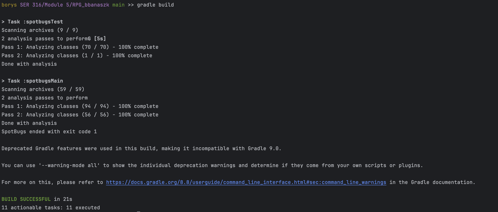
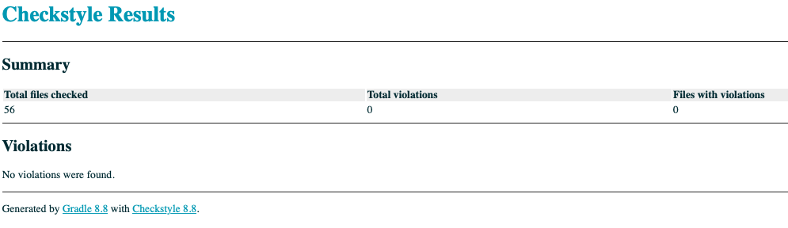
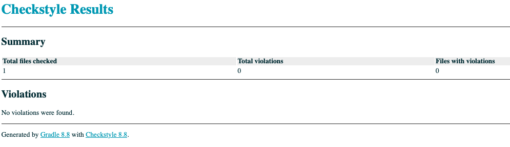
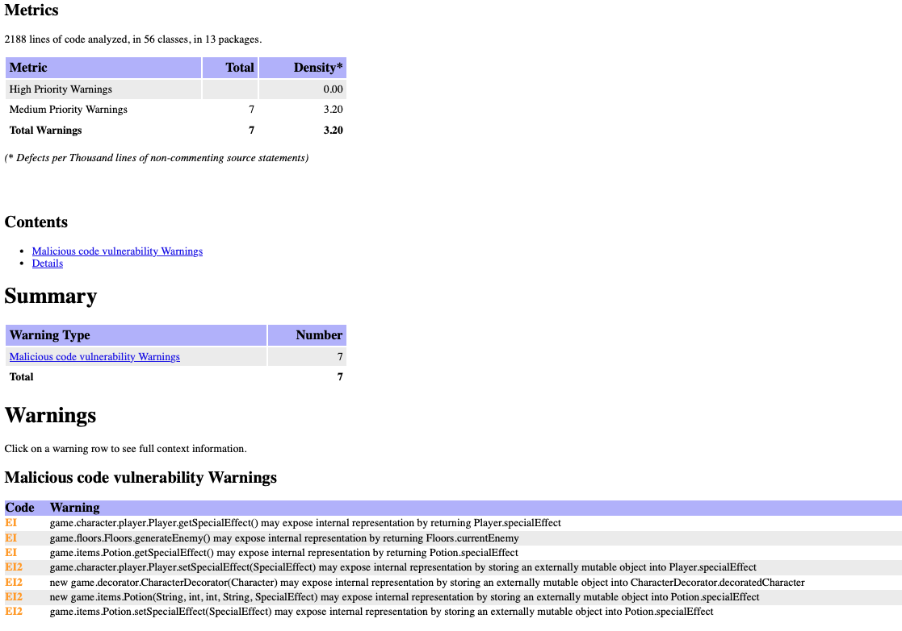
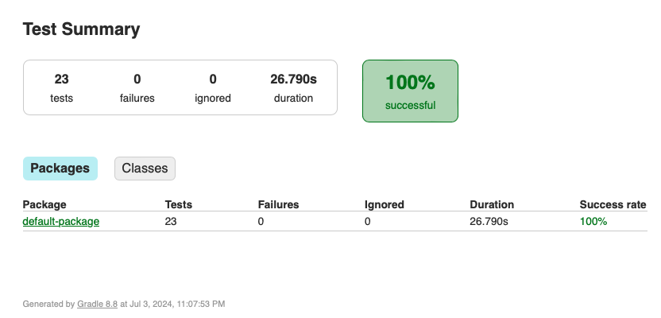
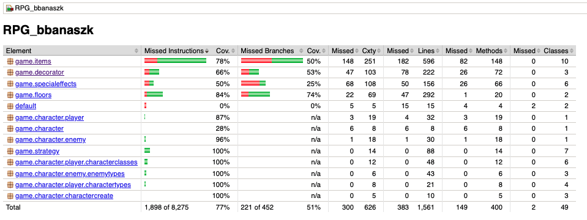

# SER316 - Borys Banaszkiewicz

## Design Patterns
I chose to implement 4 design patterns that all work together to have the program working as it should.

First, I chose the Factory design pattern for generating the Characters. The reason why I did this is because there are
many different combinations that can be obtained when creating a playable character (I have 6 character classes and 4 
character types) and each combination yields different attributes, so it made sense to create these characters by calling
a factory method and letting that method do the rest. All the character creation happens here so that the client (or game
controller) are able to only call createCharacter and can move on. This also works for generating enemies, which have 3
different types, different attributes, different loot they drop, and different xp and coins that they give when they are
defeated.

Next, I chose the decorator design pattern for managing the state of the character and the enemies throughout the game. 
I created the decorator using the same interface that was used for the factory design pattern. The reason why I chose 
this design pattern is that it allows for very easy modification to an object (in my case it's a character) by placing 
that object in a wrapper and adding new functionality without modifying the actual object that is wrapped. This was 
perfect for progressing and leveling up as all I did was add a multiplier variable that got incremented with each level 
up for both the player and the enemy, so that when calling getAttack or getDefense on an enemy or player, the decorator 
returns the original player or enemy health multiplied by the multiplier variable. This allowed the character class to 
remain completely untouched after instantiating even though the playable character was able to add items to inventory, 
level up, drink potions for special effects, lose/gain health from battles, etc. All this was done through the decorator 
without touching the character factory object.

For the combat I chose the Strategy design pattern because it allowed for a simple way to split the combat algorithms 
into classes and allowed me to generate a random move for both player or enemy by calling the strategy design interface,
letting the subclasses handle the rest. I implemented a separate class for each defense and attack algorithm and this kept
my code clean and reliable without needing to implement any combat algorithms within the main game logic.

Lastly I implemented the Mediator design pattern to handle the main flow of the game. I included only 1 method in the 
Mediator interface "updateGameState" which handles the entire game state by using cycles to progress the player through 
the game. 1 cycle is 20 floors long and is broken up into 4 parts that are swapped every 5 rounds (see comments in the 
GamePlay class that implements the FloorMediator for details). By using this design pattern, I was able to keep the entire
state of the game in my main method by using only a couple of lines of code: 3 for the creation of the character (did not 
do this in mediator just in case grader wants to play around with non-random combination of character class and type), and
1 while loop that stayed active until the game wasn't over with the only statement in the while loop being the call to the 
mediator (game.updateGameState()).

Using these design patterns together let me put together a reliable game and allowed any modifications to game logic to
be extremely easy.

Below are mainly the sources that I used to build my program.  
sources:  
[link1](https://refactoring.guru/design-patterns/catalog)  
[link2](https://www.tutorialspoint.com/design_pattern/mediator_pattern.htm)  

## Checkstyle and Spotbugs
All tests passed in checkstyle but spotbugs had some warnings that I did not think were necessary to fix. All the warnings
are due to "exposing internal representations" and with the simplicity of my program and having only 2 character types 
along with using a decorator, I don't actually modify any of these objects, so I did not think it is necessary to fix.  

  
  
  
    

## JUNIT Tests
The following are screenshot of my Test results. I did not get a chance to implement more testing as a lot of the functionality
that was left untested was also left not fully implemented due to not having time, but the major functionality was 
tested and can be seen in the Test class.  
  

# Design Pattern Requirements
## Factory Design Pattern

- [x] You must be able to choose a class for your character (or have it assigned randomly),
  each class has a different subset of skills or magic. A class would constitute something
  along the lines of ’fighter’, ’mage’, ’thief’, get creative with it!

- [x] You should be able to choose a type for your character (or have it assigned randomly),
  each race should have one passive skill that gets better after leveling up or that gives
  them advantage over another. rate A type would constitute something like, ’orc’,
  ’elf’, ’dwarf’, ’human’. Perhaps orcs are stronger naturally, perhaps elves are the
  most nimble and can dodge better, maybe humans have less HP but gain exp at a
  faster, get creative with it!

- [x] Your character should be able to equip items such as a sword, shield, helmet, armor,
  boots, etc. Your character should be able to equip a minimum of 3 unique item
  types. You get to decide what happens if you come across a second item type. For
  example, if you have 3 different swords you have programmed, and you have one
  equipped and come across another, does it automatically replace the old one? Does
  it compare stats and pick the better one? What happens if you don’t take it? If
  you only have one sword programmed and you already have one equipped and come
  across a new one, what happens?

- [x] Your character should have at minimum:
    - [x] Stats: Attack, Health, Mana/Other Resource such as cooldown, Defense, and
      speed. Others can be added.
    - [x] Should have at least 1 skill or magic power they can use
    - [x] Physical attacks should have a chance to critically strike (double damage)
    - [x] All attacks should have a chance to fail/miss
    - [x] Attacks should deal a min damage of 1

## Decorator Design Pattern

- [x] Potions should never give more Health or Mana than you have as a maximum.

- [ ] You gain experience from winning battles, at certain thresholds you should be able
  to choose a skill or magic power to upgrade. For example:
    - [ ] Lvl 1: Strike
    - [ ] Lvl 10: Double Strike

- [x] Lvl 15: Triple Strike NOTE: Leveling up should only happen when at the top floor.
  For example, if I have 300 experience and go back to the top floor and I’m level 1
  (previous experience cap = 0), if we assume the experience to level up is 10 * 2 *
  current level + previous experience cap.
  Example:

    - [x] Level 1, it would be 10 * 2 * 1 + 0 (since there was no previous level = 20 (300
      total exp - 20, so now 280)
    - [x] Level 2 would be 10 * 2 * 2 + 20 = 60 (220 remain) Overall, you should level up
      3 times with 100 exp left over towards the next level. (JUST AN EXAMPLE,
      YOU CAN USE YOUR OWN FORMULAS)

## Strategy Design Pattern

- [x] During combat:
    - [x] Attacks and item usage should happen in a turn based fashion, the participant
      with the highest speed should go first.
    - [x] When a participant reaches 0 or less HP, they lose the fight, if the loser is you,
      you lose an amount of money and go back to the top floor and only gain 20
    - [ ] During either participants turn, they can either attack or use a consumable
      item.
- [x] Your simulation should include at least 3 temporary status effect and at least 1 permanent
  status effect that either hinders or helps your character in some way. Status
  effects could include: poisoned, burned, asleep, paralyzed, strengthened, quickened,
  crippled, bleeding, cursed, etc.

## Mediator Design Pattern

- [x] You should encounter a randomly generated ’small’ enemy every floor, a ’medium’
  enemy every 5 floors, and a ’BOSS’ every 10 floors.

- [x] After each battle you should have a small chance to find a chest that contains items
  such as armor/money/potions, or a shop where you can spend your money.

- [x] The shop should sell 3 random objects, weapons, magic scrolls (good for one use),
  potions (good for one use), instant level up (RARE), get creative with it.

- [x] After each floor (and after each possible random encounter with a shop) you should
  go back to the top floor if your health is below 15%. Going to the top floor gives
  you back all of your health and mana

- [x] All enemies should get harder for each floor you travel to, for example, an enemy on
  floor 2 should be much, much weaker than an enemy on floor 48!

- [x] The game should run on cycles. A cycle is considered to be 4 parts. Q1, Q2, Q3,
  and Q4.

- [x] Each part should last around 3-5 floors have it’s own event (use your creativity,
  here’s a few examples to get started)
    - [x] Q1 - Physical attacks always deal X amount less damage
    - [x] Q2 - 5% chance to take a second turn in a row (applies to enemies as well
    - [x] Q3 - gain extra money!